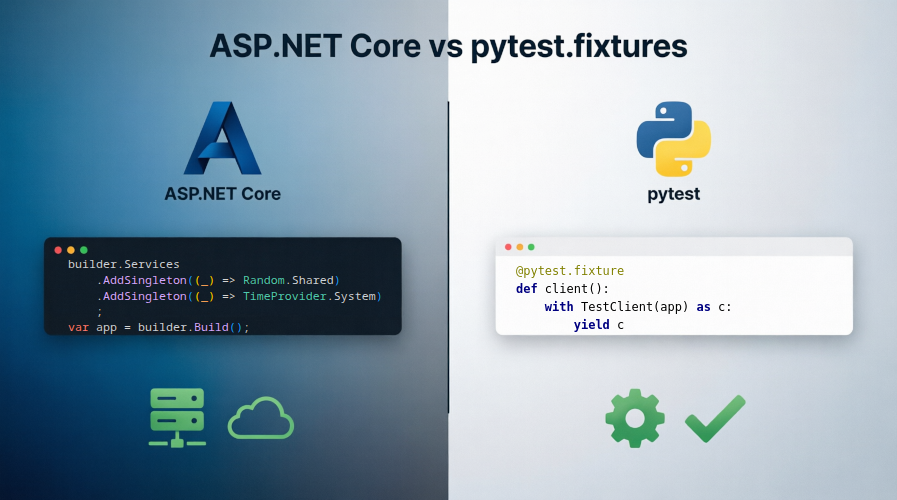

# How to Simplify ASP.NET Core API Testing



When developing applications, we strive to avoid code duplication. We extract commonly used code into libraries and use DI containers to wire them together in the *ASP.NET Core application infrastructure*.

*Testing infrastructure* for ASP.NET Core APIs follows the same pattern — but what tools help us reuse test code?

Python developers solve this problem with `pytest.fixtures`, but there's no good equivalent in the `.NET` ecosystem (`xUnit`) yet.

In this article, we'll walk through an example of how to build a full integration environment with an isolated database, fake time, and controlled randomness in just a few lines of code — and how to customize this environment for individual tests.

**Who this article is for:** .NET backend developers, technical leads, QA engineers who write code, and anyone tired of meaningless repetitive code in tests.

If you write in C# but want to add Python's elegance to your tests — welcome.

**Topics:** `.NET`, `ASP.NET Core`, `Testing`, `Integration Tests`, `xUnit`, `Open Source`

---

## Table of Contents

- [The Application Under Test (WeatherForecast API)](#the-application-under-test-weatherforecast-api)
- [Problems with the Classic Testing Approach](#problems-with-the-classic-testing-approach)
- [Solution: Fixtures as a Way of Thinking](#solution-fixtures-as-a-way-of-thinking)
- [Practice: Testing WeatherForecast API](#practice-testing-weatherforecast-api)
- [Comparison with Alternatives](#comparison-with-alternatives)
- [Conclusion: What Got Better](#conclusion-what-got-better)
- [Links and Resources](#links-and-resources)
- [Bonus: AI Time](#bonus-ai-time-)


## The Application Under Test (WeatherForecast API)

Our application is a minimal ASP.NET Core API with two endpoints:

- `POST /weatherforecast/generate` — creates a weather forecast using `TimeProvider`, `Random`, and configuration (e.g., from `appsettings.json`), and saves it to PostgreSQL via EF Core.
- `GET /weatherforecast/today` — returns today's forecast from the database.

<details>
  <summary>Full code of the test application</summary>

The application requires a `PostgreSQL` database accessible via a `ConnectionString` named `PgDb`.

```csharp
using Microsoft.EntityFrameworkCore;

namespace WebApiTestSubject;

public class Program
{
    public const string ConnectionStringName = "PgDb";

    public static void Main(string[] args)
    {
        var builder = WebApplication.CreateBuilder(args);
        builder.Services
            .AddSingleton((_) => Random.Shared)
            .AddSingleton((_) => TimeProvider.System)
            .AddDbContext<ApplicationDbContext>((sp, options) =>
            {
                var connStr = builder.Configuration.GetConnectionString(ConnectionStringName);
                options.UseNpgsql(connStr);
            });

        var app = builder.Build();

        app.MapPost("/weatherforecast/generate", async (TimeProvider tp, Random r, IConfiguration cfg, ApplicationDbContext dbCtx) =>
        {
            var now = tp.GetUtcNow();
            var date = DateOnly.FromDateTime(now.Date);
            var temperature = r.Next(100);
            var summary = cfg.GetValue<string>("summary");

            var forecast = new WeatherForecast(date, temperature, summary);
            dbCtx.WeatherForecasts.Add(new WeatherForecastEntity { Data = forecast });
            
            await dbCtx.SaveChangesAsync();
        });

        app.MapGet("/weatherforecast/today", async (TimeProvider tp, ApplicationDbContext dbCtx) =>
        {
            var now = tp.GetUtcNow();
            var today = DateOnly.FromDateTime(now.Date);

            var entity = await dbCtx.WeatherForecasts
                .Where(x => x.Data.Date == today)
                .FirstOrDefaultAsync();
                
            return entity is null ? Results.NotFound() : Results.Ok(entity.Data);
        });

        app.Run();
    }
}

public class ApplicationDbContext : DbContext
{
    public DbSet<WeatherForecastEntity> WeatherForecasts { get; init; }

    public ApplicationDbContext(DbContextOptions<ApplicationDbContext> options)
    : base(options)
    {
    }

    protected override void OnModelCreating(ModelBuilder modelBuilder)
    {
        modelBuilder.Entity<WeatherForecastEntity>().ComplexProperty(e => e.Data);
    }
}

public class WeatherForecastEntity
{
    public long Id { get; init; }
    public required WeatherForecast Data { get; init; }
}

public record WeatherForecast(DateOnly Date, int TemperatureC, string? Summary);
```

</details>

Our goal is to write a deterministic integration test that checks the entire cycle: from HTTP request to database write.

## Problems with the Classic Testing Approach

To test this application, we need to:

1. Create a `CustomWebApplicationFactory` inheriting from `WebApplicationFactory<Program>`.
2. Override `ConfigureWebHost` to replace `TimeProvider` and `Random` with mocks.
3. Create a unique database for each test; otherwise, tests will interfere with each other.
4. Create an `HttpClient` through the factory.
5. Write a test class constructor to initialize all of the above.
6. Implement `IAsyncDisposable` to remove the database and clean up other resources after the test.

And this is only for **one** test class. Imagine you have a dozen test classes, each requiring slight modifications to `WebApplicationFactory`. A hierarchy of test classes emerges, code gets copied, and maintaining it becomes increasingly difficult. **Reusing this code in other projects is a headache of its own.**

<details>
  <summary>Test code using standard means</summary>

```csharp
using System.Data.Common;
using System.Net;
using AwesomeAssertions;
using AwesomeAssertions.Json;
using FEFF.TestFixtures.AspNetCore.Randomness;
using Microsoft.AspNetCore.Hosting;
using Microsoft.AspNetCore.Mvc.Testing;
using Microsoft.EntityFrameworkCore;
using Microsoft.Extensions.Configuration;
using Microsoft.Extensions.DependencyInjection;
using Microsoft.Extensions.DependencyInjection.Extensions;
using Microsoft.Extensions.Time.Testing;
using Newtonsoft.Json.Linq;
using WebApiTestSubject;

namespace ExampleTests.AspNetCore.Basic;

internal class CustomWebApplicationFactory : WebApplicationFactory<Program>
{
    public FakeTimeProvider FakeTime { get; } = new();
    public FakeRandom FakeRandom { get; } = new();

    protected override void ConfigureWebHost(IWebHostBuilder builder)
    {
        base.ConfigureWebHost(builder);
        
        builder.ConfigureServices((ctx, _) =>
        {
            ctx.Configuration.AddSuffixToConnectionString("PgDb", Guid.NewGuid().ToString());
        });

        builder.ConfigureServices(services =>
            services.TryReplaceSingleton<TimeProvider>(FakeTime)
        );
        
        builder.ConfigureServices(services =>
            services.TryReplaceSingleton<Random>(FakeRandom)
        );

        builder.UseSetting("summary", "sunny");
    }
}

public sealed class BasicApiTests : IAsyncLifetime
{
    internal CustomWebApplicationFactory App { get; }
    internal HttpClient Client { get; }
    internal AsyncServiceScope Scope { get; }

    internal FakeTimeProvider AppTime => App.FakeTime;
    internal FakeRandom AppRandom => App.FakeRandom;
    internal ApplicationDbContext AppDbCtx => Scope.ServiceProvider.GetRequiredService<ApplicationDbContext>();

    public BasicApiTests()
    {
        App = new();
        Client = App.CreateClient();

        // Application starts here
        Scope = App.Services.CreateAsyncScope();
    }

    public async ValueTask DisposeAsync()
    {
        await AppDbCtx.Database.EnsureDeletedAsync(TestContext.Current.CancellationToken);
        await Scope.DisposeAsync();
        Client.Dispose();
        await App.DisposeAsync();
    }

    public async ValueTask InitializeAsync()
    {
        await AppDbCtx.Database.EnsureCreatedAsync(TestContext.Current.CancellationToken);
    }
    
    #region tutorial: ASP.NET Core Application Testing

    /// <summary>
    /// Test: POST /weatherforecast/generate creates a forecast using time, random, and env var,
    /// persists it to the database, and GET /weatherforecast/today returns it.
    ///
    /// This test verifies the full integration flow:
    /// 1. Configure fake time, fake random, and environment variable
    /// 2. POST to /weatherforecast/generate
    /// 3. Query the database directly to verify persistence
    /// 4. GET /weatherforecast/today to verify the API returns the persisted record
    /// </summary>
    [Fact]
    public async Task Example_Tutorial_Asp__Api__should_persist_and_return()
    {
        // Arrange
        var expectedDate = "2025-06-15";
        var expectedTemperature = 42;
        var expectedSummary = "sunny";

        AppTime.SetUtcNow(DateTimeOffset.Parse($"{expectedDate}T12:00:00Z"));
        AppRandom.Int32Next = FixedNextStrategy.From(expectedTemperature);

        // ACT
        await PostAsync(Client, "/weatherforecast/generate", null);

        // Assert
        var forecastEntities = await AppDbCtx.WeatherForecasts.ToListAsync(TestContext.Current.CancellationToken);
        var forecasts = forecastEntities.Select(x => x.Data).ToList();
        JToken.FromObject(forecasts)
            .Should().BeEquivalentTo($$"""
            [
                {
                    "Date": "{{expectedDate}}",
                    "TemperatureC": {{expectedTemperature}},
                    "Summary": "{{expectedSummary}}",
                }
            ]
            """);

        // ACT
        var response = await GetAsync(Client, "/weatherforecast/today");

        // Assert
        response
            .Should().BeEquivalentTo(
            $$"""
            {
                "date": "{{expectedDate}}",
                "temperatureC": {{expectedTemperature}},
                "summary": "{{expectedSummary}}"
            }
            """);
    }
    #endregion

    #region helpers

    private static async Task<JToken> GetAsync(HttpClient client, string url)
    {
        var getResp = await client.GetAsync(url, TestContext.Current.CancellationToken);
        var getBody = await getResp.Content.ReadAsStringAsync(TestContext.Current.CancellationToken);
        getResp.StatusCode.Should().Be(HttpStatusCode.OK, getBody);
        return JToken.Parse(getBody);
    }

    private static async Task PostAsync(HttpClient client, string url, string? data)
    {
        StringContent? sc = null;
        if (data != null)
            sc = new StringContent(data, System.Text.Encoding.UTF8, "application/json");
            
        var resp = await client.PostAsync(url, sc, TestContext.Current.CancellationToken);
        var body = await resp.Content.ReadAsStringAsync(TestContext.Current.CancellationToken);
        resp.StatusCode.Should().Be(HttpStatusCode.OK, body);
    }
    #endregion
}

internal static class HelperExtensions
{
    public static IServiceCollection TryReplaceSingleton<TService>(this IServiceCollection services, TService instance)
        where TService : class
    {
        var srcType = typeof(TService);
        var oldD = services.SingleOrDefault(d => d.ServiceType == srcType);
        if (oldD == null)
            return services;

        if(oldD.Lifetime != ServiceLifetime.Singleton)
            throw new InvalidOperationException();

        var sdNew = new ServiceDescriptor(srcType, instance);
        services.Replace(sdNew);

        return services;
    }
    
    internal static void AddSuffixToConnectionString(this IConfiguration config, string connectionStringName, string suffix)
    {
        var key = "ConnectionStrings:" + connectionStringName;
        var cs = config[key];
        var csb = new DbConnectionStringBuilder
        {
            ConnectionString = cs
        };
        csb["Database"] = $"{csb["Database"]}-{suffix}";
        var newCs = csb.ConnectionString;
        config[key] = newCs;
    }
}

```
</details>

## Solution: Fixtures as a Way of Thinking

I've been developing in both Python and C# for a long time. In the Python ecosystem, there's [`@pytest.fixture`](https://docs.pytest.org/en/stable/explanation/fixtures.html):
> In testing, a fixture provides a defined, reliable, and consistent context for the tests. This could include an environment (for example, a database configured with known parameters) or content (such as a dataset).

In other words, a fixture is a dedicated, reusable test code component that includes state, initialization and cleanup methods. The fixture state is explicitly used to execute tests, while initialization and cleanup methods are called implicitly by the test engine.

Need a temporary directory? Use `pytest.tmp_path`. Need to mock the current time? There's `pytest-freezegun`. All of this is assembled through declarative dependencies (fixtures are passed as test function arguments).

Every time I start a new project in C#, I catch myself thinking: "It's a pity there are no fixtures like in Python. Why do I need to write (copy and adjust) several classes for a simple integration test?"

This inspired the idea of applying the pytest fixtures philosophy to .NET. The result is the **FEFF.TestFixtures** library.

Here's how it works:
- You mark a class with the `[Fixture]` attribute.
- If a fixture needs other fixtures, you pass them in the constructor. The system automatically resolves the dependency graph.
- You request a fixture in a test via `TestContext.Current.GetFeffFixture<T>()`.
- If you need to release resources, the fixture must implement `IDisposable` or `IAsyncDisposable`.
- Scope determines when a fixture is created and removed: per test, per class, per collection, or per entire assembly.
- If needed, combine fixtures through composition.
- Testing ASP.NET Core Web APIs comes with a solid set of out-of-the-box fixtures. Reusability at last!

Sounds familiar? Yes, it's the same approach as in pytest. Let's dive into practice.

## Practice: Testing WeatherForecast API

### Step 1. Add Packages to the Test Project (xUnit.v3)

The example uses the `xUnit` test framework version 3 or above.<br/>
`TUnit` is also supported.

```bash
dotnet add package FEFF.TestFixtures.XunitV3
dotnet add package FEFF.TestFixtures.AspNetCore
dotnet add package FEFF.TestFixtures.AspNetCore.EF
dotnet add package AwesomeAssertions
dotnet add package AwesomeAssertions.Json
```

> `AwesomeAssertions` is a fork of `FluentAssertions` that provides a more convenient assertion API.

### Step 2. Activate the Extension

In any test project file, add an attribute to activate the fixture system:

```csharp
[assembly: FEFF.TestFixtures.Xunit.TestFixturesExtension]
```

### Step 3. Isolate the Database

To ensure tests can run in parallel without interfering with each other, each test must work with its own database. For this, we'll create a configuration fixture:

```csharp
[Fixture]
public class OptionsFixture : ITmpDatabaseNameFixtureOptions
{
    public IReadOnlyCollection<string> ConnectionStringNames => ["PgDb"];
}
```

This class is used to configure `TmpDatabaseNameFixture`, which automatically intercepts the `"PgDb"` connection string and appends a unique suffix to the `Database` field.

### Step 4. Assemble the FixtureSet

Instead of inheriting from base classes, we use composition. Let's create a `FixtureSet` — a record that combines everything needed to test our API:

```csharp
[Fixture]
public record FixtureSet(
    AppManagerFixture<Program> AppManagerFx,
    FakeRandomFixture<Program> FakeRandomFx,
    FakeTimeFixture<Program> FakeTimeFx,
    AppClientFixture<Program> ClientFx,
    DatabaseLifecycleFixture<Program, ApplicationDbContext> DbFx,
    TmpDatabaseNameFixture<Program, OptionsFixture> TmpDbNameFx
);
```

Each element is a fixture that solves its own task:

| Fixture | What It Does | Parameters |
|---------|--------------|------------|
| **AppManagerFixture** | Manages the lifecycle of the application under test. Allows changing configuration before startup. | `Program` — entry point of the tested application (a `WebApplicationFactory<Program>` is created inside this fixture) |
| **AppClientFixture** | Provides an `HttpClient` connected to the test application. | `Program` — * |
| **FakeRandomFixture** | Replaces `Random` with a deterministic generator. | `Program` — * |
| **FakeTimeFixture** | Replaces `TimeProvider`. Any date can be set. | `Program` — * |
| **DatabaseLifecycleFixture** | Creates, removes, and provides access to the database in the test context. | `Program` — *<br/>`ApplicationDbContext` — EF Core context |
| **TmpDatabaseNameFixture** | Guarantees a unique database name for each test. | `Program` — *<br/>`OptionsFixture` — fixture with configuration (the name of the connection string to patch is passed) |

Note: fixtures marked with (*) depend on `AppManagerFixture<Program>` because they need to register service replacements in the application's DI container. For the fixture system to resolve dependencies, we need to specify the `Program` parameter. Everything else will be done automatically.

### Step 5. Create the Test Class

```csharp
public class ApiTests
{
    // Fixtures are materialized here
    protected FixtureSet FixtureSet { get; } =
        TestContext.Current.GetFeffFixture<FixtureSet>();

    // Convenient properties for quick access
    protected FakeRandom AppRandom => 
        FixtureSet.FakeRandomFx.Value;

    protected FakeTimeProvider AppTime => 
        FixtureSet.FakeTimeFx.Value;

    protected IAppConfigurator AppConfigurationBuilder => 
        FixtureSet.AppManagerFx.ConfigurationBuilder;

    protected HttpClient Client => 
        FixtureSet.ClientFx.LazyValue;

    protected ApplicationDbContext AppDbCtx => 
        FixtureSet.DbFx.LazyDbContext;

    protected IDatabaseLifecycleFixture DbFx => 
        FixtureSet.DbFx;
}
```

That's it. The test infrastructure is ready!

### Step 6. Write Tests

```csharp
    [Fact]
    public async Task Generate_weatherforecast__should_persist_and_return()
    {
        // Arrange
        var expectedDate = "2025-06-15";
        var expectedTemperature = 42;
        var expectedSummary = "sunny";

        // Fix time: today is June 15, 2025
        AppTime.SetUtcNow(DateTimeOffset.Parse($"{expectedDate}T12:00:00Z"));

        // Fix randomness: temperature is always 42
        AppRandom.Int32Next = FixedNextStrategy.From(expectedTemperature);

        // Replace configuration before application starts
        AppConfigurationBuilder.UseSetting("summary", expectedSummary);

        // Create an isolated database
        // Application starts at this point
        await DbFx.EnsureCreatedAsync(TestContext.Current.CancellationToken);

        // Act: generate forecast
        await PostAsync(Client, "/weatherforecast/generate", null);

        // Assert: did the data really get into the database?
        var forecasts = await AppDbCtx.WeatherForecasts
            .Select(x => x.Data)
            .ToListAsync(TestContext.Current.CancellationToken);

        JToken.FromObject(forecasts)
            .Should().BeEquivalentTo($$"""
            [
                {
                    "Date": "{{expectedDate}}",
                    "TemperatureC": {{expectedTemperature}},
                    "Summary": "{{expectedSummary}}"
                }
            ]
            """);

        // Act: request today's forecast via API
        var response = await GetAsync(Client, "/weatherforecast/today");

        // Assert: does the API return what's in the database?
        response.Should().BeEquivalentTo($$"""
            {
                "date": "{{expectedDate}}",
                "temperatureC": {{expectedTemperature}},
                "summary": "{{expectedSummary}}"
            }
            """);
    }
```

### What's Happening Here?

1. **Determinism.** We fixed time to June 15, 2025, and temperature to 42 degrees. The test no longer depends on system clocks and randomness.
2. **Flexibility.** We changed the application configuration by setting the value "sunny" for the "summary" variable. We can easily modify the test application for individual tests.
3. **Isolation.** `TmpDatabaseNameFixture` guarantees that this test works with its own database. Even if you run hundreds of tests in parallel — each gets a unique DB.
4. **Automatic cleanup.** After the test, `DatabaseLifecycleFixture` removes the temporary database, `AppClientFixture` releases `HttpClient`, and `AppManagerFixture` stops the application. We didn't write a single line of cleanup code.

## Comparison with Alternatives

### xUnit Native Fixtures

The native xUnit mechanism (`IClassFixture<T>`, `ICollectionFixture<T>`, `AssemblyFixtureAttribute`) solves the same problem but with significant limitations:

| Capability | FEFF.TestFixtures | xUnit Native |
|------------|-------------------|--------------|
| Fixture with test-case scope | ✅ Available | ❌ No |
| Dependency resolution between fixtures | ✅ Available | ❌ No |
| Convenience of fixture materialization | ✅ One method | ⚠️ Several interfaces and constructors |
| Built-in fixtures | ✅ For ASP.NET Core, DB, time | ❌ No |
| Async setup | ⚠️ Manual call | ✅ `IAsyncLifetime` |

The main difference: when using `xUnit`, you'll either have to copy setup code or build complex inheritance hierarchies. `FEFF.TestFixtures` offers reuse through composition.

### Pytest

For those coming from Python:

| | Python (pytest) | .NET (FEFF.TestFixtures) |
|-|-----------------|--------------------------|
| Fixture declaration | `@pytest.fixture` attribute on function | `[Fixture]` attribute on class |
| Usage in test | Function argument: `def test_something(db, client):` | Static method call: `TestContext.Current.GetFeffFixture<T>()` |
| Scope management | `scope="function"` / `"session"` | `FixtureScopeType.TestCase` / `Assembly` |
| Temporary folder fixture | `tmp_path` | `TmpDirectoryFixture` |
| Time fixture | `pytest-freezegun` | `FakeTimeFixture` |
| Database fixture | `pytest-postgresql` | `TmpDatabaseNameFixture` + `DatabaseLifecycleFixture` |

The philosophy is the same — declarative dependency declaration, automatic lifecycle management, composition over inheritance.

Differences:

| | Python (pytest) | .NET (FEFF.TestFixtures) |
|-|-----------------|--------------------------|
| Fixture scope | Defined by the fixture author during implementation | Defined by the test author when using the fixture |
| Mixing scopes | Fixtures can depend on fixtures with different scopes | Dependent fixtures are created in the same scope |

## Conclusion: What Got Better

Let's summarize. At the beginning of the article, an ASP.NET Core API integration test looked like this:

- Inheritance from `WebApplicationFactory`.
- Overriding `ConfigureWebHost`.
- Setup code in the test class.
- `IDisposable` in the test class for cleanup.
- Duplicating all of this in every test class and **in every project**.

With FEFF.TestFixtures.AspNetCore:

- ✅ Declarative description of test infrastructure through `FixtureSet` (via composition).
- ✅ Ability to customize `WebApplicationFactory` for individual tests (via composition).
- ✅ Setup code takes exactly one line.
- ✅ No cleanup code — fixtures handle this.
- ✅ Fixtures can (and should) be reused across different projects.

This became possible due to the features of the `FEFF.TestFixtures` project:

1. Modular `WebApplicationFactory`.
2. An extension to the `xUnit` fixture system that adds:
    - Dependencies between fixtures,
    - Test-case level fixtures.
3. A set of ready-made fixtures for testing `AspNetCore` and beyond.

If, like me, you miss the elegance of `pytest` in the .NET world — give `FEFF.TestFixtures` a try. It’s no silver bullet, but it’s a step toward making testing both a convenient and truly useful tool.

## Links and Resources

- 📦 **NuGet:** [FEFF.TestFixtures.AspNetCore](https://www.nuget.org/packages/FEFF.TestFixtures.AspNetCore)
- 📚 **Documentation:** https://metacoder-feff.github.io/FEFF.TestFixtures/
- 💻 **Source code:** https://github.com/metacoder-feff/FEFF.TestFixtures
- 🧪 **Test code from the article:** [ApiTests.cs](https://github.com/metacoder-feff/FEFF.TestFixtures/blob/main/examples/ExampleTests.AspNetCore/ApiTests.cs)
- 📝 **Tested application:** [WebApiTestSubject](https://github.com/metacoder-feff/FEFF.TestFixtures/blob/main/tests/Subjects/WebApiTestSubject/Program.cs)

---

## Bonus: AI Time ✨

Ask your assistant to generate such tests for your project using the following prompt:

> In file `<path-to-test-file>.cs`<br/>
> Generate API tests for the application `<web-api-project-name-or-path>`<br/>
> Using FEFF.TestFixtures Library:
> - https://github.com/metacoder-feff/FEFF.TestFixtures/tree/main
> - https://metacoder-feff.github.io/FEFF.TestFixtures/articles/tutorials/asp-net-core-application-testing.html
>
> Use the latest stable versions of the FEFF.TestFixtures.* packages.

Make sure to replace the placeholders with the actual paths to your source project and the target test file. 

If you're working with a large application, it's best to list specific endpoints and/or business functions directly in the prompt.
To generate additional tests, simply ask the AI to create them following the same pattern as the existing ones.

---

*Author — a developer who believes that good tests should be written with the same ease as good production code.*

*If you found this article useful, share your experience in the comments. I'd be glad to get feedback and questions!*
